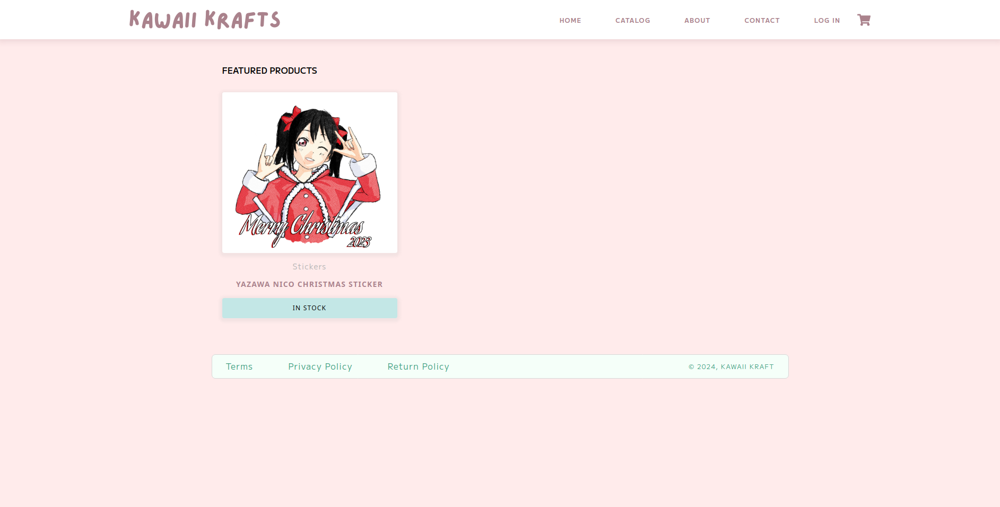

# Kawaii Krafts

Demo of an e-commerce site similar to shopify & booth




## Building & Running

### Environment variables

Create a server .env file in the server/ and add the following
```
PORT
MONGO_URL
MONGO_DB_NAME
JWT_SECRET_KEY
SERVER_URL = <frontend url>
STRIPE_PRIVATE_KEY
STRIPE_ENDPOINT_SECRET
EMAIL_USER = <site email address>
EMAIL_PASSWORD
ORIGIN = <frontend url>
```

Create a client .env file in the web/ and add the following
```
VITE_API_URL = <backend url>
VITE_IMAGES_CDN = <backend cnd url>
VITE_STRIPE_KEY
```

### Server

Install the required packages using `npm i` or `yarn install`

Then you can run initiating the `index.js` file or use a tool such as [PM2](https://github.com/Unitech/pm2)

```
pm2 start index.js --name kawaii-kraft-server
```

### Client

Install the required packages using `npm i` or `yarn install`

Build the package using `npm run build` or `yarn build`

Now you can serve the dist/ folder.
